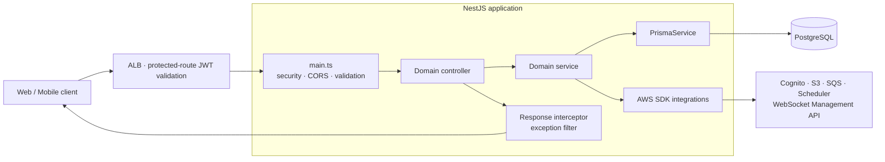
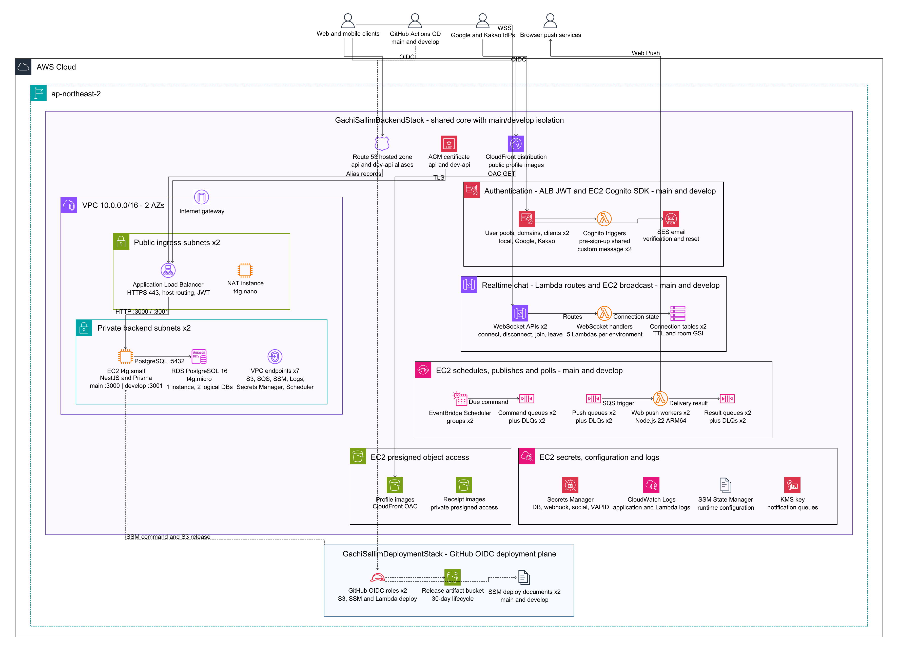

# GachiSallim Backend

같이살림의 공동생활 관리 API 서버입니다. 가족·룸메이트처럼 함께 사는 그룹의 구성원이 집안일,
공동 지출과 정산, 공용 물품, 생활 규칙, 채팅과 알림을 한곳에서 관리할 수 있도록 REST API와
실시간 메시지·Web Push 기능을 제공합니다.

- API prefix: `/api/v1`
- Swagger UI: `/api-docs`
- Health check: `/api/v1/health`
- Runtime: Node.js 22, NestJS 11, TypeScript

## 주요 기능

- Cognito 기반 이메일·비밀번호 인증과 Google/Kakao 소셜 로그인
- 그룹 초대, 멤버 역할과 기능별 권한 관리
- 반복 집안일, 공동 지출·정산, 공용 물품과 생활 규칙 관리
- 그룹 대시보드와 활동 내역 조회
- 채팅방·메시지 REST API와 API Gateway WebSocket 실시간 전파
- 인앱 알림, 사용자별 알림 설정과 SQS/Lambda 기반 Web Push
- 프로필 이미지의 CloudFront 제공과 영수증 이미지의 권한 기반 presigned 조회

## 문서 안내

- 처음 실행하려면 [시작하기](#시작하기)를 확인합니다.
- 코드 배치를 이해하려면 [아키텍처](#아키텍처)와 [프로젝트 구조](#프로젝트-구조)를 확인합니다.
- schema 변경은 [데이터베이스와 migration](#데이터베이스와-migration), 운영 변경은
  [배포](#배포)와 [운영 전 준비](#운영-전-준비)를 먼저 확인합니다.

## 기술 스택

| 영역               | 기술                                                                          |
| ------------------ | ----------------------------------------------------------------------------- |
| 애플리케이션       | Node.js 22, NestJS 11, TypeScript                                             |
| 데이터             | PostgreSQL 16, Prisma 5                                                       |
| API                | REST, Swagger/OpenAPI, class-validator                                        |
| 인증               | Amazon Cognito, Google OAuth, Kakao OIDC                                      |
| 실시간·비동기 처리 | API Gateway WebSocket, Lambda, DynamoDB, SQS, EventBridge Scheduler, Web Push |
| 스토리지           | Amazon S3, CloudFront                                                         |
| 인프라·배포        | AWS CDK 2, EC2, RDS, ALB, Systems Manager, GitHub Actions OIDC                |
| 품질               | Jest, ESLint, Prettier                                                        |

## 아키텍처

### 애플리케이션 요청 흐름



`src/main.ts`가 전역 API prefix, Helmet, 압축, CORS, Swagger와 `ValidationPipe`를 설정합니다.
요청 DTO에 선언되지 않은 필드는 거부됩니다. 배포 환경에서는 ALB가 공개 인증·health route를
제외한 요청의 Cognito JWT claim을 먼저 검증하고, 보호된 NestJS endpoint의
`CognitoAccessTokenGuard`가 Cognito에 token 활성 상태를 확인한 뒤 인증 context를 구성합니다.
`src/app.module.ts`는 도메인 모듈과 공용 `PrismaModule`을 조합하는 애플리케이션의 진입점입니다.

성공과 오류는 전역 `ResponseInterceptor`와 `HttpExceptionFilter`가 다음 envelope로 통일합니다.

```json
{
  "statusCode": 200,
  "data": {},
  "error": null
}
```

```json
{
  "statusCode": 400,
  "data": null,
  "error": {
    "code": "DOMAIN_ERROR_CODE",
    "message": "오류 설명"
  }
}
```

`errors`는 DTO field별 상세 정보가 있을 때만 포함됩니다.

각 도메인은 보통 다음 경계를 따릅니다.

1. Controller가 HTTP 계약과 인증된 요청을 받습니다.
2. DTO가 입력을 변환하고 검증합니다.
3. Service가 도메인 규칙과 트랜잭션을 처리합니다.
4. `PrismaService`와 AWS 연동 service/provider가 데이터베이스와 관리형 서비스에 접근합니다.
5. 같은 디렉터리의 `*.spec.ts`가 controller, service와 주요 규칙을 검증합니다.

### AWS 인프라



다이어그램 원본은
[`docs/architecture/gachisallim-aws-architecture.yaml`](docs/architecture/gachisallim-aws-architecture.yaml)에
있습니다. 저장소 root에서 PATH에 설치된 AWS Diagram-as-Code `awsdac` v0.23으로 다시 생성합니다.
YAML이 기준 source이며 변경 시 생성된 PNG도 함께 commit합니다.

```bash
awsdac docs/architecture/gachisallim-aws-architecture.yaml \
  --output docs/architecture/gachisallim-aws-architecture.png --force
```

핵심 구성은 다음과 같습니다.

- **Ingress와 compute**: Route 53과 ACM이 환경별 API 도메인을 제공하고, ALB가 host 기반으로
  요청을 분기해 private subnet의 단일 ARM64 EC2로 전달합니다. `main`과 `develop`은 서로 다른
  systemd service와 port를 사용합니다.
- **Data와 object storage**: 하나의 RDS PostgreSQL instance 안에서 환경별 logical database를
  분리합니다. 프로필 이미지는 S3와 CloudFront로 제공하고, 영수증 이미지는 인증·그룹 멤버십을
  확인한 뒤 짧은 수명의 presigned URL로만 노출합니다.
- **Authentication**: 환경별 Cognito User Pool이 로컬 계정과 Google/Kakao identity를 통합합니다.
  Cognito trigger Lambda가 계정 연결과 비밀번호 재설정 메시지를 처리합니다.
- **Realtime chat**: 환경별 API Gateway WebSocket API와 Lambda route가 연결 상태를 DynamoDB에
  저장합니다. NestJS 애플리케이션은 메시지를 저장한 뒤 연결된 client에 broadcast합니다.
- **Notifications**: EC2가 집안일 알림 schedule과 outbox를 관리하고 SQS에 작업을 발행합니다.
  Lambda worker가 Web Push를 전송하며 결과 queue를 통해 데이터베이스 상태를 갱신합니다.
- **Operations**: VPC endpoint, Secrets Manager, Systems Manager와 CloudWatch Logs가 private
  runtime의 구성·비밀·로그를 담당합니다. GitHub Actions는 장기 access key 대신 OIDC role을
  사용해 배포합니다.

## 프로젝트 구조

```text
.
├── src/
│   ├── common/                 # 공통 응답, 예외, filter, interceptor, decorator, utility
│   ├── config/                 # 환경 변수 검증과 CORS 설정
│   ├── domains/                # 비즈니스 도메인별 Nest module
│   │   ├── activities/
│   │   ├── auth/               # account, common, password, registration, session
│   │   ├── chat/
│   │   ├── chores/
│   │   ├── dashboard/
│   │   ├── expenses/
│   │   ├── groups/
│   │   ├── notifications/
│   │   ├── rules/
│   │   └── supplies/
│   ├── health/                 # 애플리케이션·DB health check
│   ├── prisma/                 # 전역 PrismaModule과 PrismaService
│   ├── app.module.ts           # root module과 전역 provider 조합
│   └── main.ts                 # HTTP bootstrap과 전역 middleware 설정
├── prisma/
│   ├── migrations/             # 순서대로 적용되는 PostgreSQL migration
│   ├── schema.prisma           # 데이터 모델과 enum의 기준
│   └── seed.ts                 # 생활 규칙 기본 category seed
├── infra/
│   ├── assets/                 # CDK가 배포하는 기본 프로필 avatar
│   ├── bin/app.ts              # CDK app entrypoint
│   ├── lambda/                 # Cognito, WebSocket, Web Push Lambda handler
│   └── lib/                    # runtime stack과 deployment stack
├── scripts/                    # release build/deploy, DB 확인, VAPID provisioning
├── test/                       # 애플리케이션 e2e test
├── docs/architecture/          # AWS 다이어그램과 재생성 가능한 source
└── .github/workflows/          # CI와 branch 기반 CD workflow
```

### 도메인 모듈

| 도메인          | 책임                                                                       |
| --------------- | -------------------------------------------------------------------------- |
| `auth`          | 회원가입, 세션, token 갱신·폐기, 비밀번호, 프로필, 계정 삭제와 social 가입 |
| `groups`        | 그룹 생성·가입·초대, 멤버와 역할, 기능별 권한                              |
| `chores`        | 반복 집안일 생성·조회·수정·완료·공유와 마감 알림 schedule                  |
| `expenses`      | 공동 지출, 분담금 계산·정산, 송금 계좌, 영수증 이미지와 webhook            |
| `supplies`      | 공용 물품 요청, 상태 변경, 구매와 지출 공유                                |
| `rules`         | 생활 규칙, 동의 상태, 활성화 상태와 공유                                   |
| `dashboard`     | 그룹별 집안일·지출·공용 물품 요약                                          |
| `chat`          | 채팅방, 멤버 설정, 메시지, 읽음 상태와 WebSocket broadcast                 |
| `notifications` | 인앱 알림, 선호 설정, Push 구독·전송, outbox와 queue consumer              |
| `activities`    | 그룹 활동 이력 조회                                                        |

### 새 도메인 추가 위치

현재 구조에는 별도 repository 계층을 두지 않습니다. 새 도메인은 기존 모듈과 같은 형태로
`src/domains/<domain>/`에 응집합니다.

```text
src/domains/<domain>/
├── dto/
│   └── <operation>.dto.ts
├── <domain>.controller.ts
├── <domain>.module.ts
├── <domain>.service.ts
└── *.spec.ts
```

1. Controller에는 route와 Swagger decorator, 필요한 `CognitoAccessTokenGuard`를 둡니다.
2. DTO에는 `class-validator` 기반 request validation을 선언합니다.
3. Service에는 도메인 규칙과 transaction을 두고 전역 `PrismaService`를 주입합니다. Prisma client를
   새로 생성하지 않습니다.
4. Module이 controller와 provider를 조합하며, 새 최상위 도메인 module은 `src/app.module.ts`에
   등록합니다.
5. 인접 `*.spec.ts`에는 controller/service 규칙을, 실제 API 흐름은 `test/`의 e2e spec에 둡니다.

## 시작하기

### 준비 사항

- Node.js 22와 npm
- Docker와 Docker Compose
- 전체 application을 실행할 경우 접근 가능한 develop AWS 자격 증명과 resource 정보

### 로컬 실행

```bash
git clone https://github.com/GachiSallim-UMC/backend.git
cd backend
npm install

cp .env.example .env
# .env의 WEBHOOK_SECRET을 로컬 전용 값으로 변경
docker compose up -d

npm run prisma:generate
npm run prisma:migrate:deploy
npm run prisma:seed
npm run start:dev
```

`.env.example`의 `DATABASE_URL`은 `docker-compose.yml`의 PostgreSQL user, password, database와
일치합니다. `npm run prisma:seed`는 생활 규칙 category를 upsert하므로 다시 실행해도 안전합니다.

`.env.example`의 AWS resource 값은 환경 변수 형식만 보여 주는 예시입니다. application bootstrap
후 notification consumer가 SQS polling을 시작하므로 전체 server를 안정적으로 실행하려면 유효한
develop Cognito, S3/CloudFront, SQS, EventBridge Scheduler와 WebSocket resource 값 및 AWS 자격
증명이 필요합니다. AWS 없이 지원되는 별도 local mode나 LocalStack 구성은 없습니다. AWS를 쓰지
않는 unit test는 provider를 mock하고 `NODE_ENV=test`에서 background consumer를 시작하지 않습니다.
`WEBHOOK_SECRET`에는 저장소의 금지된 기본값이 아닌 로컬 전용 문자열을 설정합니다.

기본 `PORT=3000` 기준으로 다음 주소를 사용할 수 있습니다.

| 용도         | URL                                   |
| ------------ | ------------------------------------- |
| API root     | `http://localhost:3000/api/v1`        |
| Swagger UI   | `http://localhost:3000/api-docs`      |
| Health check | `http://localhost:3000/api/v1/health` |

### 환경 변수

전체 목록과 형식은 [`.env.example`](.env.example)과 `src/config/env.validation.ts`가 기준입니다.

| 그룹            | 주요 변수                                                       | 설명                                                       |
| --------------- | --------------------------------------------------------------- | ---------------------------------------------------------- |
| 애플리케이션    | `NODE_ENV`, `PORT`, `APP_NAME`, `APP_VERSION`, `CORS_ORIGIN`    | `CORS_ORIGIN`은 `*` 또는 comma로 구분한 origin 목록입니다. |
| 데이터베이스    | `DATABASE_URL`                                                  | PostgreSQL connection URL입니다.                           |
| 인증·이미지     | `AWS_REGION`, `COGNITO_*`, `PROFILE_IMAGE_*`, `RECEIPT_IMAGE_*` | Cognito와 S3/CloudFront 연동 정보입니다.                   |
| 알림            | `NOTIFICATION_*`, `NOTIFICATION_VAPID_PUBLIC_KEY`               | command, push, result queue와 polling 설정입니다.          |
| 집안일 schedule | `CHORE_DUE_*`                                                   | EventBridge Scheduler group, role, 시간과 timezone입니다.  |
| 지출 webhook    | `WEBHOOK_SECRET`                                                | 외부 결제/핀테크 webhook 검증용 secret입니다.              |

## 개발 명령

| 명령                                                             | 용도                                  |
| ---------------------------------------------------------------- | ------------------------------------- |
| `npm run start:dev`                                              | watch mode로 로컬 서버 실행           |
| `npm run lint`                                                   | TypeScript source lint                |
| `npm run format:check`                                           | Prettier formatting 확인              |
| `npm run build`                                                  | NestJS 애플리케이션 build             |
| `bash scripts/build-notification-web-push.sh <output-directory>` | Lambda용 Web Push worker bundle build |
| `npm test`                                                       | unit·integration spec 실행            |
| `npm run test:e2e`                                               | 별도 e2e 설정으로 API test 실행       |
| `npm run prisma:generate`                                        | Prisma Client 생성                    |
| `npm run prisma:migrate:dev -- --name <name>`                    | 로컬 schema 변경 migration 생성       |
| `npm run prisma:migrate:deploy`                                  | 이미 생성된 migration 적용            |
| `npm run prisma:seed`                                            | 기본 생활 규칙 category upsert        |
| `npm run cdk:synth`                                              | CloudFormation template 합성          |
| `npm run cdk:diff`                                               | 배포 전 infrastructure 변경 확인      |

PR을 열기 전 최소 검증은 다음과 같습니다.

```bash
npm run prisma:generate
npm run lint
npm run build
bash scripts/build-notification-web-push.sh /tmp/gachisallim-notification-worker
npm test
npm run cdk:synth
```

## 데이터베이스와 migration

`prisma/schema.prisma`가 관계형 모델의 기준이며 인증 사용자, 그룹, 집안일, 지출·분담금, 공용 물품,
생활 규칙·동의, 채팅, 알림·Push delivery와 활동 로그를 정의합니다.

schema를 변경할 때는 다음 순서를 따릅니다.

1. `prisma/schema.prisma`를 수정합니다.
2. 로컬 PostgreSQL에서 `npm run prisma:migrate:dev -- --name <name>`으로 migration을 생성합니다.
3. 생성된 SQL과 이전 application version의 호환성을 검토합니다.
4. `npm run prisma:generate` 후 관련 test와 build를 실행합니다.

생성된 Prisma Client 파일은 직접 수정하지 않습니다. CI/CD와 배포 환경에서는
`npm run prisma:migrate:deploy`만 사용합니다.

## 배포

### 환경 분리

| Branch    | API                               | EC2 port | PostgreSQL database   | GitHub environment |
| --------- | --------------------------------- | -------- | --------------------- | ------------------ |
| `main`    | `https://api.gachisallim.com`     | `3000`   | `gachisallim`         | `production`       |
| `develop` | `https://dev-api.gachisallim.com` | `3001`   | `gachisallim_develop` | `development`      |

현재 AWS resource는 `ap-northeast-2`에 배포되며 물리 infrastructure 일부를 공유하고 환경별
application·data 경계를 논리적으로 분리합니다.

| 공유 resource                                              | 환경별 분리 resource                                                   |
| ---------------------------------------------------------- | ---------------------------------------------------------------------- |
| VPC와 subnet, Route 53 hosted zone, ACM certificate, ALB   | API host, target group, EC2 port와 systemd service                     |
| 단일 EC2와 RDS PostgreSQL instance                         | PostgreSQL logical database와 Cognito User Pool·client·domain          |
| profile·receipt S3 bucket, profile CloudFront distribution | S3 object prefix, WebSocket API·DynamoDB connection table              |
| application log group와 notification KMS key               | notification queue·DLQ·worker, chore schedule group·role               |
| release artifact bucket                                    | webhook·social auth·VAPID 설정, GitHub OIDC role과 SSM deploy document |

### CDK stack

| Stack                        | 책임                                                                               |
| ---------------------------- | ---------------------------------------------------------------------------------- |
| `GachiSallimDeploymentStack` | GitHub OIDC role, release artifact bucket, 환경별 SSM deploy document              |
| `GachiSallimBackendStack`    | VPC, ALB, EC2, RDS, Cognito, WebSocket, notification, image storage와 runtime 설정 |

### 최초 인프라 배포 순서

다음 순서는 새 AWS 환경을 구성할 때의 선행 조건을 포함합니다. `GachiSallimBackendStack`은 EC2,
RDS, ALB 등 과금 resource를 생성하므로 deploy 직전에 반드시 `npm run cdk:diff`를 확인합니다.

1. `gachisallim` AWS CLI profile이 대상 account와 `ap-northeast-2`에 접근하는지
   `aws sts get-caller-identity --profile gachisallim`로 확인합니다. target account에는 source에 지정된
   GitHub Actions OIDC provider, Route 53 hosted zone과 SES domain identity가 있어야 합니다.
   참조 ARN, hosted zone ID와 domain은 `infra/lib/deployment-stack.ts`와
   `infra/lib/backend-stack.ts`의 상단 constant가 기준입니다.
2. 해당 account/region을 아직 CDK bootstrap하지 않았다면 한 번 실행합니다.

   ```bash
   npx cdk bootstrap aws://<account-id>/ap-northeast-2 --profile gachisallim
   ```

3. GitHub OIDC role, release bucket과 SSM deploy document를 담은 foundation stack을 배포합니다.

   ```bash
   npm run cdk:deploy:foundation -- \
     --profile gachisallim \
     --region ap-northeast-2
   ```

4. 두 환경의 runtime 선행 resource를 준비합니다. 상세 이름과 값은 [운영 전 준비](#운영-전-준비)를
   따릅니다.

   - `main`, `develop`의 social auth secret
   - `main`, `develop`의 expense webhook secret
   - `main`, `develop`의 VAPID secret과 public-key parameter

5. backend stack의 diff를 확인하고 runtime infrastructure를 배포합니다.

   ```bash
   npm run cdk:diff -- GachiSallimBackendStack \
     --profile gachisallim \
     --region ap-northeast-2

   AWS_PROFILE=gachisallim AWS_REGION=ap-northeast-2 \
     npm run cdk:deploy:backend -- \
     --profile gachisallim \
     --region ap-northeast-2
   ```

6. backend stack output의 Cognito IdP response URL을 Google/Kakao provider console에 등록합니다.
7. GitHub의 `production`, `development` environment에 다음 variable을 설정합니다.

   - `AWS_DEPLOY_ROLE_ARN`: 각 환경의 `MainDeployRoleArn` 또는 `DevelopDeployRoleArn` output
   - `ARTIFACT_BUCKET`: 두 환경 모두 foundation stack의 `ArtifactBucketName` output

8. repository variable `CD_ENABLED=true`로 바꾼 뒤, 배포할 `main` 또는 `develop`에 새 commit을
   push합니다. 해당 push의 CI가 성공하면 최초 CD가 실행됩니다. GitHub Actions 실행을 확인한 다음
   환경별 `/api/v1/health`가 `200`을 반환하는지 검증합니다.

### CI/CD 흐름

1. `main` 또는 `develop`의 PR·push에서 GitHub Actions CI가 dependency 설치, Prisma Client 생성,
   lint, build, Web Push worker build, test와 CDK synth를 실행합니다.
2. merge 후 branch push의 CI가 성공하고 해당 commit이 branch의 최신 commit이며 repository variable
   `CD_ENABLED=true`일 때만 CD가 실행됩니다.
3. ARM64 release bundle과 SHA-256 checksum을 S3 artifact bucket에 업로드하고 환경별 Web Push Lambda
   code를 갱신합니다.
4. GitHub Actions가 OIDC로 환경별 IAM role을 획득하고 SSM document로 EC2 배포 명령을 실행합니다.
5. EC2는 release와 checksum을 내려받아 무결성을 검증합니다. RDS stack이 기본 `gachisallim`
   database를 만들며, release script는 대상 database가 없으면 `ensure-database.cjs`로 생성한 뒤
   Prisma migration을 적용합니다. 따라서 최초 `develop` 배포에서 `gachisallim_develop`이 생성됩니다.
6. 새 release로 symbolic link를 전환하고 systemd service를 재시작한 뒤, 최대 60초 동안 local health
   endpoint를 확인합니다.
7. 성공하면 환경별 최신 release directory 3개만 유지합니다. health check에 실패하면 이전 link로
   되돌려 service를 재시작하며, 이전 release가 없으면 link를 제거하고 service를 중지합니다.

Web Push Lambda code는 EC2 배포보다 먼저 갱신되며 현재 pipeline에는 Lambda의 자동 rollback 단계가
없습니다. Lambda 배포 실패 또는 EC2와의 version 불일치는 GitHub Actions 실행 결과를 기준으로 별도
복구해야 합니다.

### Migration과 rollback 계약

자동 rollback은 systemd process와 application release link만 이전 version으로 되돌립니다. 이미
적용된 PostgreSQL migration은 역실행하지 않으므로 모든 migration은 직전 application release와
호환되는 expand/contract 순서를 따라야 합니다.

1. 새 column/table/index처럼 이전 code와 함께 동작하는 expand migration을 먼저 배포합니다.
2. 새 code가 안정화되고 이전 release로 rollback할 필요가 없어졌는지 확인합니다.
3. column 제거 또는 의미 변경 같은 contract migration은 별도 후속 배포로 적용합니다.

이 계약을 지킬 수 없는 migration은 application 자동 배포와 분리하고 백업·점검·복구 절차를 갖춘
수동 변경으로 처리합니다.

## 운영 전 준비

### 지출 webhook secret

배포 script는 환경별 Secrets Manager `SecretString` 전체를 `WEBHOOK_SECRET`으로 주입합니다. 다음
이름으로 금지된 기본값과 다른 충분히 긴 random string을 저장합니다. JSON object가 아닌 raw string
secret입니다.

- 운영: `gachisallim/main/webhook`
- 개발: `gachisallim/develop/webhook`

### Web Push VAPID

notification Web Push worker를 배포하기 전에 환경별 VAPID key pair를 한 번 생성합니다. 명령은
idempotent하며 생성된 key를 출력하지 않습니다.

```bash
npm run vapid:provision -- \
  --environment develop \
  --subject mailto:ops@gachisallim.com \
  --profile gachisallim \
  --region ap-northeast-2
```

운영은 별도의 key pair로 `--environment main`을 사용합니다. 명령은 다음 resource를 생성합니다.

- Secrets Manager: `gachisallim/{environment}/notification-vapid`
- SSM Parameter: `/gachisallim/{environment}/notification-vapid-public-key`

secret에는 `publicKey`, `privateKey`, `subject`가 저장됩니다. public key는 backend가 signing secret을
읽지 않아도 되도록 SSM Parameter에 별도로 저장합니다. 두 resource가 이미 있으면 key를 rotate하지
않으며, CDK는 해당 환경 Lambda worker에만 secret read 권한을 부여합니다.

인증된 client는 `GET /api/v1/notification-push-subscriptions/vapid-public-key`로 public key를 받아
`PushManager.subscribe`의 `applicationServerKey`로 전달합니다. browser subscription은 다음 순서로
backend와 동기화합니다.

1. Service Worker를 등록하고 사용자에게 notification 권한을 요청합니다.
2. 받은 public key로 `PushManager.subscribe`를 호출합니다.
3. 반환된 `endpoint`, `keys.p256dh`, `keys.auth`를
   `POST /api/v1/notification-push-subscriptions`에 등록합니다.
4. 현재 device 목록은 같은 path의 `GET`, 해지는
   `DELETE /api/v1/notification-push-subscriptions/:subscriptionId`를 사용합니다.

#### 전달 보장

Web Push는 at-least-once로 전달됩니다. Push service가 알림을 수락한 뒤 result message 발행이
실패하면 Lambda가 원본 SQS message를 재시도하므로 사용자가 중복 알림을 받을 수 있습니다. 안정적인
`deliveryId`는 result 처리를 idempotent하게 만들지만 외부 Push 호출의 exactly-once를 보장하지는
않습니다.

worker는 이 경우 `RESULT_PUBLISH_FAILURE_AFTER_PUSH` CloudWatch structured log를 `deliveryId`, 원본
SQS `messageId`, `receiveCount`와 함께 남깁니다. Web Push `topic`은 provider가 지원할 때 대기 중인
알림을 collapse할 수 있지만 정확성 보장으로 간주하지 않습니다.

### 소셜 로그인

Cognito User Pool이 이메일·비밀번호와 Google, Kakao 로그인의 단일 token issuer입니다. 배포 전에
환경별 Secrets Manager secret을 생성합니다.

- 운영: `gachisallim/main/social-auth`
- 개발: `gachisallim/develop/social-auth`

```json
{
  "googleClientId": "...",
  "googleClientSecret": "...",
  "kakaoClientId": "...",
  "kakaoClientSecret": "..."
}
```

redirect URL은 역할이 다른 두 종류입니다.

| 구간                            | 등록할 URL                                                                                                     |
| ------------------------------- | -------------------------------------------------------------------------------------------------------------- |
| Google/Kakao provider → Cognito | provider console에 CDK output의 `ProductionCognitoIdpResponseUrl` 또는 `DevelopmentCognitoIdpResponseUrl` 등록 |
| Cognito → frontend              | Cognito app client가 허용한 환경별 `/auth/callback` 사용                                                       |

Kakao 앱은 OpenID Connect를 활성화하고 이메일을 필수 동의 항목으로 설정해야 합니다.

프론트엔드 연동 순서는 다음과 같습니다.

1. PKCE verifier/challenge와 `state`, `nonce`를 생성해 redirect 동안 안전하게 보관합니다.
2. 환경별 `CognitoDomainUrl`의 `/oauth2/authorize`를 Authorization Code + PKCE(S256)로 엽니다.
   `identity_provider`는 `Google` 또는 `Kakao`를 사용하고
   `openid email profile aws.cognito.signin.user.admin` scope를 요청합니다.
3. frontend callback에서 반환된 `state`를 검증합니다.
4. authorization code와 PKCE verifier를 Cognito `/oauth2/token`으로 교환하고 ID token의 `nonce`를
   검증합니다.
5. access token으로 `GET /api/v1/auth/me`를 호출합니다. `200`이면 기존 사용자입니다.
6. `404`이면 이름과 닉네임을 받아 `POST /api/v1/auth/social/signup`을 호출합니다.

social 가입 요청은 Cognito access token을 Bearer header로 전달하며 body는 다음과 같습니다.

```json
{
  "name": "홍길동",
  "nickname": "길동"
}
```

운영 callback은 `https://gachisallim.com/auth/callback`, 개발 callback은
`https://dev.gachisallim.com/auth/callback`과 `http://localhost:5173/auth/callback`입니다. 로그아웃할
때는 backend의 `/api/v1/auth/logout`을 먼저 호출한 뒤 다음 Cognito URL로 이동해 managed login
cookie도 정리합니다. `logout_uri`는 app client에 등록된 운영·개발·localhost `/login` URL 중 현재
환경과 일치하는 값을 URL encode해 사용합니다.

```text
{CognitoDomainUrl}/logout?client_id={CognitoClientId}&logout_uri={encodedAllowedLogoutUri}
```

### 기본 프로필 avatar

CDK는 기본 avatar 10종을 profile image bucket의 `default-avatars/`에 배포합니다. 공개 base URL은
`DefaultAvatarBaseUrl` CloudFormation output에서 확인합니다.

```text
{DefaultAvatarBaseUrl}/avatar-1.png
...
{DefaultAvatarBaseUrl}/avatar-10.png
```

프론트엔드는 `avatar-1` 같은 식별자가 아니라 전체 URL을 `profileImage`로 전송합니다. 고정 파일명은
최대 24시간 cache될 수 있습니다.

### 비밀번호 재설정 이메일

runtime stack은 `ap-northeast-2` SES에서 검증된 `gachisallim.com` domain identity와 DKIM을 사용해
Cognito가 `noreply@gachisallim.com`에서 비밀번호 재설정 link를 발송하도록 구성합니다. SES가 sandbox
상태이면 같은 region에서 검증한 수신자와 SES mailbox simulator로만 발송할 수 있습니다.

프론트엔드는 `/reset-password#email=...&code=...`에서 이메일과 인증 code를 읽고
`POST /api/v1/auth/password/reset`을 호출합니다. code는 URL fragment에 두어 server, CDN과 referrer에
노출되지 않도록 합니다.

## Git workflow

- 기본 branch: `main`
- 통합 branch와 PR 기본 target: `develop`
- 작업 branch: `type/#issue-number/feature-name`
- 예시: `feat/#12/add-auth`, `fix/#34/validation-error`

PR은 관련 issue를 연결하고 동작 변경, 사용자·개발자 영향과 실제 검증 결과를 기록합니다.
